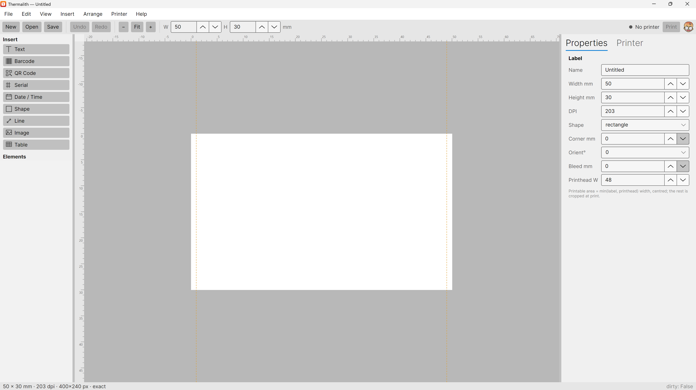

# The main window

When Thermalith opens it shows a single window with everything you need to design and print a label.

The window has six areas:

- **Menu bar** — *File · Edit · View · Insert · Arrange · Printer · Help*. Every command lives here,
  and the most common ones are mirrored on the toolbar and the right-click menu.
- **Toolbar** — quick access to **New**, **Open**, **Save**, **Undo**, **Redo**, the zoom controls
  (**−**, **Fit**, **+**), and the label's **W**(idth) and **H**(eight) in millimetres. On the right
  it shows the current printer status (e.g. *No printer*) and the **Print** button.
- **Insert palette** (left, under *Insert*) — one button per element type you can add to the label:
  Text, Barcode, QR Code, Serial, Date / Time, Shape, Line, Image, Table.
- **Elements list** (left, under *Elements*) — every element currently on the label. See
  *[Element properties](04-element-properties.md)* for how to use it.
- **Canvas** (centre) — the label itself, drawn on a grey work surface with rulers along the top and
  left. The white area is the label; the dashed guides mark the **printable area** (see
  *[Creating a label](02-creating-a-label.md)*).
- **Inspector** (right) — two tabs, **Properties** and **Printer**. *Properties* shows the settings
  for whatever is selected (the label itself, or a single element); *Printer* is where you connect
  and print (see *[Printing](07-printing.md)*).

## The status bar

Along the bottom edge, the status bar shows the label's size and resolution — for example
`50 × 30 mm · 203 dpi · 400×240 px · exact` — and a **dirty** indicator that reads `True` when the
label has unsaved changes.

## Zooming and panning

Use the **−**, **Fit**, and **+** toolbar buttons to zoom out, fit the label to the window, or zoom
in. **Fit** is the quickest way to recentre if you lose the label off-screen.
