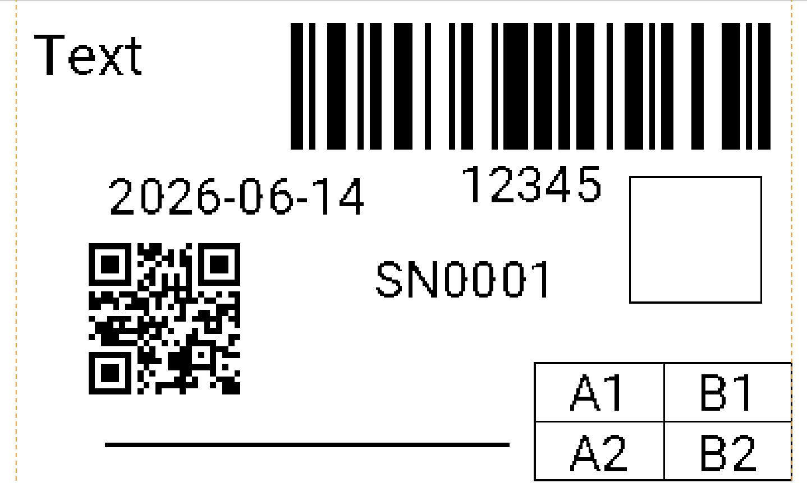

# Creating a label

A new label opens at a default size. Before adding content, set it to match the roll you will print
on. With nothing selected, the **Properties** tab shows the **Label** settings.

## Label settings

- **Name** — a name for the label (used when you save it).
- **Width mm** / **Height mm** — the physical size of the label in millimetres. You can also set
  these from the **W** and **H** boxes on the toolbar.
- **DPI** — the printer's resolution. This is normally set for you from the connected printer or the
  catalogue (the B1 is 203 dpi). Leave it as-is unless you know your model differs.
- **Shape** — *rectangle*, *rounded*, *circle*, or *dieCut*, to match the label stock.
- **Corner mm** — the corner radius, used when **Shape** is *rounded*.
- **Orient°** — rotates the whole label relative to the print head (0, 90, 180, 270).
- **Bleed mm** — an optional margin outside the safe area for die-cut stock; the app warns if content
  falls outside it.
- **Printhead W** — the print head's printable width. Leave blank to use the printer's own value.

## The printable area

NIIMBOT labels have a printable width that is slightly **narrower than the physical label**. For
example, a 50 mm-wide B1 label only prints across about 48 mm. Thermalith draws the printable area as
**dashed guides** on the canvas, and crops anything outside it at print time, centred. Keep important
content (text, barcodes, codes) inside the guides so nothing is clipped.

> **Tip:** the on-screen preview is *print-true* — the `exact` mode shown in the status bar is what
> actually burns onto the label, including how thin lines and light shades come out on thermal paper.

## Saving and opening

Use **File → Save** (or the toolbar **Save**) to write the label to a `.nlbl` file, and **File →
Open** to load one back. The `.nlbl` file holds the whole label — its size, every element, and any
embedded images — in one file.

<table width="100%"><tr>
<td width="50%" align="left" valign="bottom"></td>
<td width="50%" align="right" valign="bottom"></td>
</tr></table>
