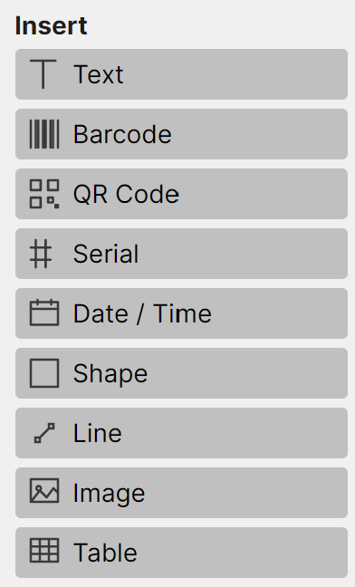
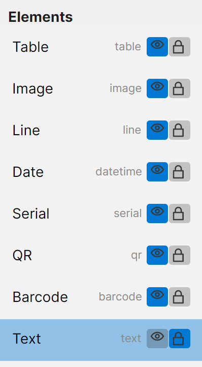

# Adding elements

Everything on a label — text, a barcode, an image — is an **element**. You add elements from the
**Insert** palette on the left.

## Adding an element

Click an entry in the **Insert** palette to add that element to the label:

- **Text** — a line or block of text.
- **Barcode** — a 1-D barcode (Code 128, EAN, UPC, and more).
- **QR Code** — a 2-D QR code.
- **Serial** — an auto-incrementing number that advances each time you print.
- **Date / Time** — a date or time, fixed or filled in at print time.
- **Shape** — a rectangle, rounded rectangle, or ellipse.
- **Line** — a straight line.
- **Image** — a picture from a file (converted to black-and-white for thermal printing).
- **Table** — a grid of cells.

The new element appears on the canvas, selected and ready to position. Each element type and its own
settings are covered in *[Element types](05-element-types.md)*.

## The Elements list

Every element you add is listed under **Elements** on the left — this is your layers panel.

Each row shows the element's **name** and **type**, with two toggles:

- The **eye** toggles whether the element is **visible**.
- The **lock** toggles whether the element is **locked** (locked elements can't be moved or edited on
  the canvas).

Click a row to select that element; its settings then appear in the **Properties** tab. The list also
reflects stacking order — see *[Arranging and editing](06-arranging-and-editing.md)* for changing
which elements sit in front.

<table width="100%"><tr>
<td width="50%" align="left" valign="bottom"></td>
<td width="50%" align="right" valign="bottom"></td>
</tr></table>
