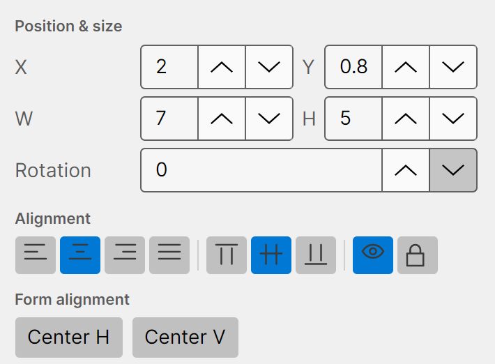
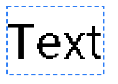
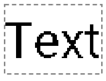

# Element properties

When you select an element, the **Properties** tab shows its settings. Every element shares a common
set of properties at the top; below those are the settings specific to that element's type (covered in
*[Element types](05-element-types.md)*).

## Common properties

- **Name** — a label for this element, shown in the Elements list.
- **Position & size**
  - **X** / **Y** — the position of the element's top-left corner, in millimetres. Negative values
    are allowed so an element can sit partly off the label edge.
  - **W** / **H** — the element's width and height in millimetres.
  - **Rotation** — rotation in degrees, clockwise, about the element's centre.
- **Alignment** — the first group sets how content sits *inside* the element: horizontal
  (left / centre / right / justify) and vertical (top / middle / bottom). The last two buttons on this
  row are:
  - **Eye** — show or hide the element.
  - **Lock** — lock or unlock the element.
- **Form alignment** — **Center H** and **Center V** centre the element *on the label* horizontally
  or vertically. Handy for getting something exactly in the middle.

All values update the canvas live as you change them.

## Selecting, moving, and resizing

- **Click** an element on the canvas (or its row in the Elements list) to select it. A selected
  element shows a dashed outline with resize handles.

  

- **Drag** the body to move it; **drag a handle** to resize.
- Hold and drag on an empty part of the canvas to **marquee-select** several elements at once.

## Visibility and locking

Use the **eye** and **lock** toggles — on the Alignment row, in the Elements list, or from the
right-click menu.

- A **hidden** element stays in the file but isn't drawn or printed.
- A **locked** element can't be moved, resized, or edited on the canvas, which protects it from
  accidental changes. Its outline is shown differently so you can tell at a glance.

