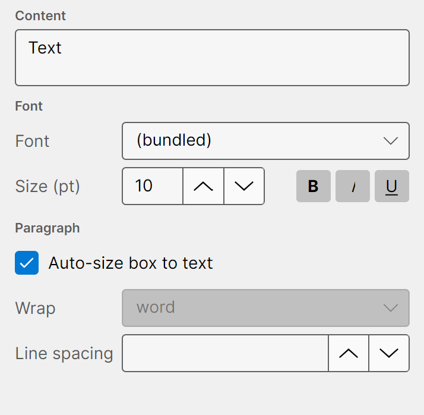
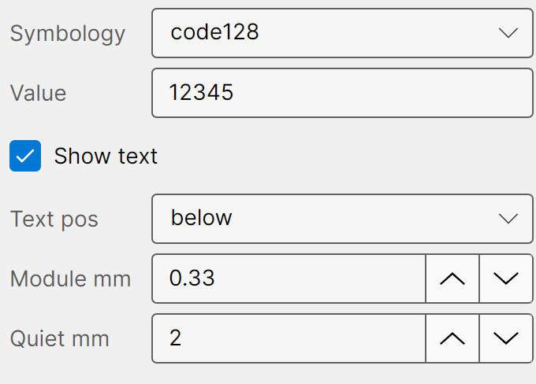
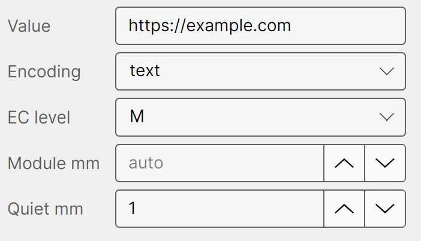
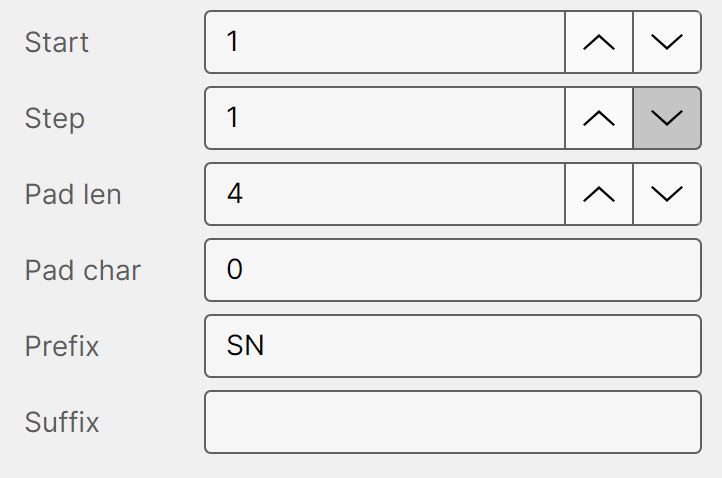
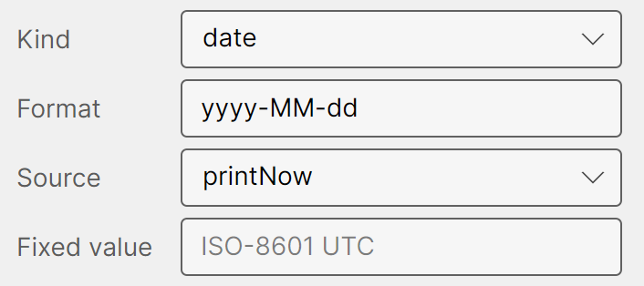
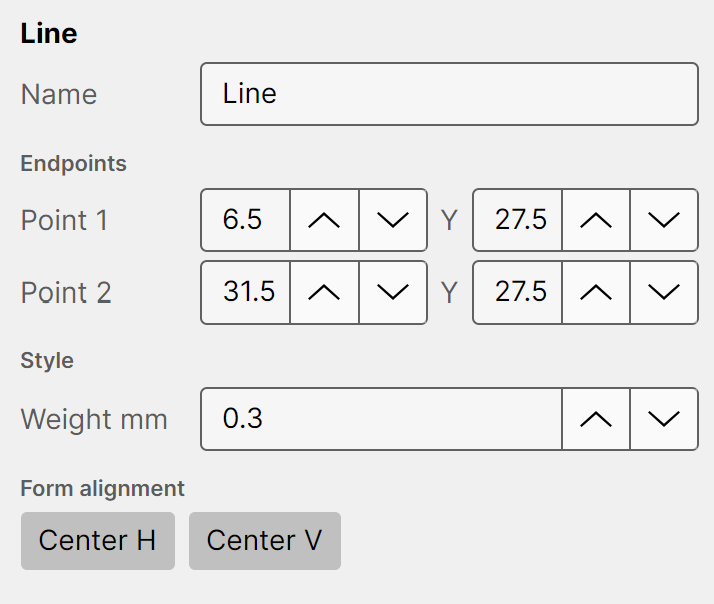
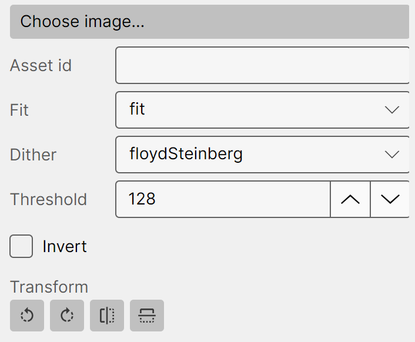
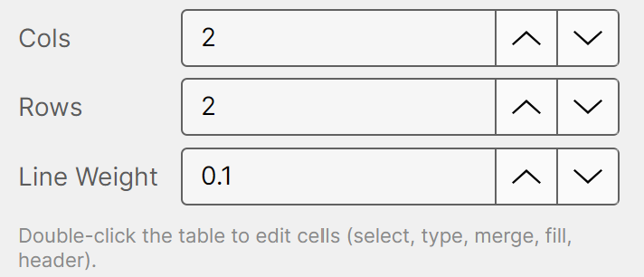
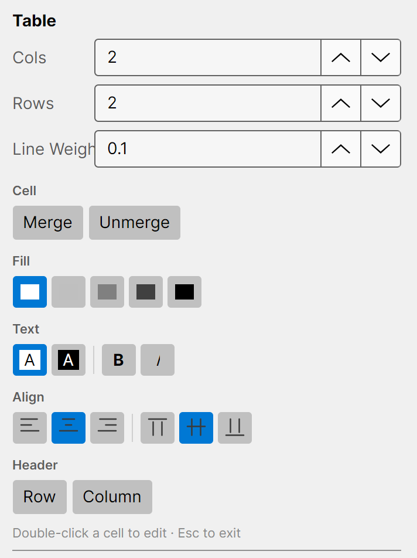

# Element types

Each element type has its own settings, shown below the common properties when the element is
selected. This chapter covers every type.

## Text

- **Content** — the text to print. Multi-line is supported.
- **Font** — pick any font installed on your system. If a saved label uses a font you don't have,
  Thermalith substitutes a bundled fallback and flags it.
- **Size (pt)** and the **B** / **I** / **U** buttons — point size, bold, italic, underline.
- **Auto-size box to text** — when on, the box hugs the text and there are no resize handles. Turn it
  off for a fixed-size box with word wrap.
- **Wrap** — how text wraps within a fixed box (*none* or *word*).
- **Line spacing** — multiplier for the gap between lines (1.0 = single).

## Barcode

- **Symbology** — the barcode standard (Code 128, Code 39, EAN-13/8, UPC-A/E, ITF, Codabar).
- **Value** — the data to encode. It must be valid for the chosen symbology.
- **Show text** — print the human-readable value as well as the bars.
- **Text pos** — where that text appears (*above*, *below*, or *none*).
- **Module mm** — the width of the narrowest bar. Larger values scan more reliably.
- **Quiet mm** — the blank margin on each side, required for reliable scanning.

> **Scannability:** if the module width rounds to less than one printer dot at the current DPI, the
> code may not scan and Thermalith warns you. Give barcodes a little more width if in doubt.

## QR Code

- **Value** — the data to encode.
- **Encoding** — *text* for normal data, or *hex* for a binary payload entered as hex.
- **EC level** — error-correction level (*L*, *M*, *Q*, *H*). Higher levels survive more damage but
  pack less data into the same size.
- **Module mm** — the size of each QR cell, or *auto* to fit the box.
- **Quiet mm** — the blank margin around the code (about four modules is recommended).

## Serial

A serial number that **advances automatically each time you print**, so a run of labels is numbered
in sequence.

- **Start** — the first value.
- **Step** — how much to add per label.
- **Pad len** / **Pad char** — pad the number to a fixed width (e.g. `00042`).
- **Prefix** / **Suffix** — text added before and after the number.

## Date / Time

- **Kind** — *date*, *time*, or *datetime*.
- **Format** — the display format (a .NET format string, e.g. `yyyy-MM-dd`).
- **Source** — *printNow* fills in the current date/time at print, or *fixed* uses a set value.
- **Fixed value** — the value to use when **Source** is *fixed* (ISO-8601, UTC).

## Shape

A rectangle, rounded rectangle, or ellipse, for boxes, borders, and dividers.

- **Shape** — *rect*, *roundedRect*, or *ellipse*.
- **Stroke mm** — outline thickness (0 = no outline).
- **Fill** — *none* (outline only) or *solid* (filled black).
- **Corner mm** — corner radius, used by *roundedRect*.

## Line

A straight line between two points — good for dividers, underlines, and accents.

- **Point 1** and **Point 2** — the two endpoints (X and Y, in millimetres, relative to the element).
- **Weight mm** — line thickness.
- **Center H** / **Center V** — centre the line on the label.

On the canvas, drag either **endpoint handle** to reshape the line, or drag the body to move it.

## Image

Thermal printers are black-and-white only, so images are converted to 1-bit using dithering.

- **Choose image…** — pick a picture file; it's embedded into the label.
- **Asset id** — the internal reference to the embedded image (set for you).
- **Fit** — how the image fills its box (*fill*, *fit*, *stretch*, *center*).
- **Dither** — the black-and-white conversion method (*floydSteinberg*, *atkinson*, *ordered*,
  *threshold*, or *none*). Try a different dither if a photo looks muddy.
- **Threshold** — the black/white cut-off (0–255), used when **Dither** is *threshold*.
- **Invert** — swap black and white.
- **Transform** — rotate the image 90° left/right, or flip it horizontally/vertically.

## Table

A grid of cells. With the table selected, the basic settings are:

- **Cols** / **Rows** — the number of columns and rows.
- **Line Weight** — the thickness of the cell borders (0 = no borders).

### Editing cells

**Double-click** the table to enter **cell-edit mode**. Then:

- **Click** a cell to select it; **drag** to select a block of cells.
- **Type** to edit the active cell; press **Esc** (or click outside the table) to exit cell mode.

In cell-edit mode the **Properties** tab shows the cell controls:

- **Merge** / **Unmerge** — combine the selected cells into one, or split them back.
- **Fill** — a greyscale shade for the cell background (0 / 25 / 50 / 75 / 100 %).
- **Text** — black or white text, plus **Bold** / **Italic**.
- **Align** — horizontal and vertical alignment within the cell.
- **Header** — toggle a **Row** or **Column** header preset (a shaded, emphasised first row/column).

> Single-click selects the table as an object (to move, resize, or change its overall properties);
> double-click is what enters cell editing.
