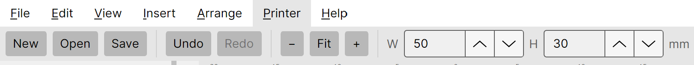
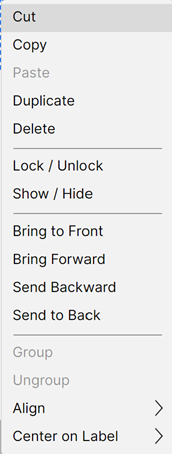

# Arranging and editing

Once you have a few elements on a label, Thermalith gives you the usual editing tools — undo, copy and
paste, alignment, stacking order, and grouping — from the toolbar, the **Edit** and **Arrange** menus,
and the right-click menu.

## The toolbar

The toolbar carries the everyday commands: **New**, **Open**, **Save**, **Undo**, **Redo**, the zoom
controls, the label **W**/**H** boxes, the printer status, and **Print**.

## Undo and redo

Every change can be undone. Use **Undo** / **Redo** on the toolbar, the **Edit** menu, or the standard
keyboard shortcuts (see *[Keyboard shortcuts](08-about-and-shortcuts.md)*).

## Clipboard

Select one or more elements, then **Cut**, **Copy**, **Paste**, or **Duplicate** them from the **Edit**
or right-click menu. Pasting drops a copy onto the label ready to position.

## The right-click menu

Right-click an element (or selection) on the canvas for the most common actions in one place.

It includes Cut / Copy / Paste / Duplicate / Delete, **Lock / Unlock**, **Show / Hide**, the stacking
commands, **Group / Ungroup**, and the **Align** and **Center on Label** submenus described below.

## Aligning elements

Select two or more elements and use **Arrange → Align** (or the right-click **Align** submenu) to line
them up by their edges or centres. To centre a single element on the label, use **Center on Label**, or
the **Center H** / **Center V** buttons in its properties.

## Stacking order

Elements stack front-to-back. Use **Bring to Front**, **Bring Forward**, **Send Backward**, and **Send
to Back** (in **Arrange** or the right-click menu) to control which elements draw on top.

## Grouping

Select several elements and **Group** them so they move and resize together. **Ungroup** splits them
back into individual elements.

<table width="100%"><tr>
<td width="50%" align="left" valign="bottom"></td>
<td width="50%" align="right" valign="bottom"></td>
</tr></table>
