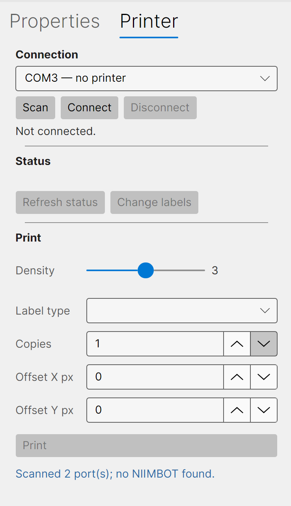
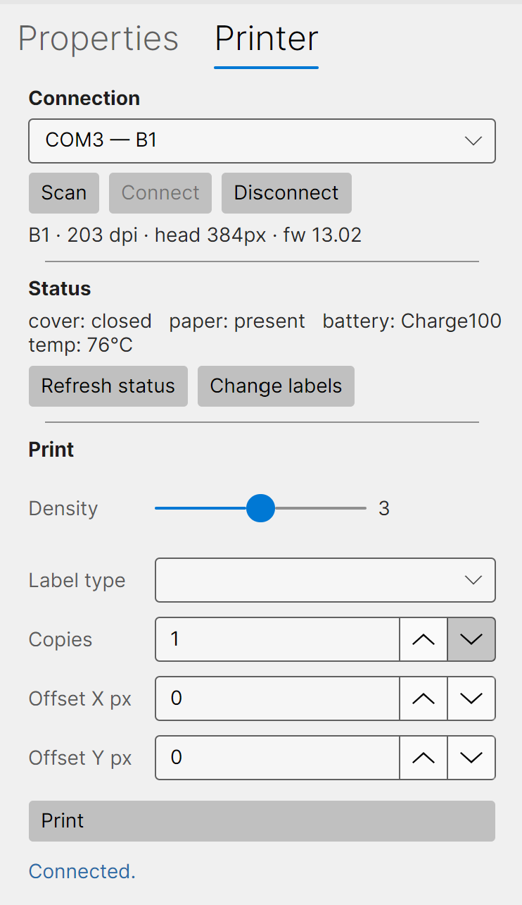

# Printing

Printing is handled from the **Printer** tab on the right. Connect your NIIMBOT printer over USB,
check its status, set the density, and print.

## Connecting a printer

Open the **Printer** tab. Before a printer is connected it shows no device and the controls are
greyed out.

1. Plug the printer in and turn it on.
2. Click **Scan** to list the available ports. Thermalith probes each one and labels it with the
   printer it finds (for example *COM3 — B1*).
3. Choose your printer from the **Connection** dropdown and click **Connect**.

Once connected, Thermalith shows the model, resolution, print-head width, and firmware version, and the
status line at the bottom reads *Connected*.

Click **Disconnect** when you're done, or to switch printers.

## Printer status

The **Status** section shows the live state of the printer — **cover** (open/closed), **paper**
(present/out), **battery**, and **temperature**. Click **Refresh status** to update it.

**Change labels** reads the roll currently loaded (on models with RFID-tagged rolls, such as the B1)
so the label setup can match the stock.

## Printing a label

In the **Print** section:

- **Density** — how dark the print is. Increase it for darker output, decrease it if fine detail is
  bleeding together. The right value depends on your label stock; a quick test print helps.
- **Label type** — the paper type, where applicable.
- **Copies** — how many labels to print.
- **Offset X px** / **Offset Y px** — nudge the printed image horizontally or vertically, in printer
  dots, to correct slight registration on your stock.

Click **Print** to send the label to the printer. (The **Print** button on the main toolbar does the
same thing.)

> **A note on alignment:** NIIMBOT printers feed the label through the head at a slight, consistent
> angle, so a printed label can show a small skew. This is a hardware characteristic — Thermalith sends
> a clean, straight image. Keep important content within the dashed printable-area guides so nothing is
> clipped, and use the **Offset** fields if the print sits slightly off-centre on your stock.
