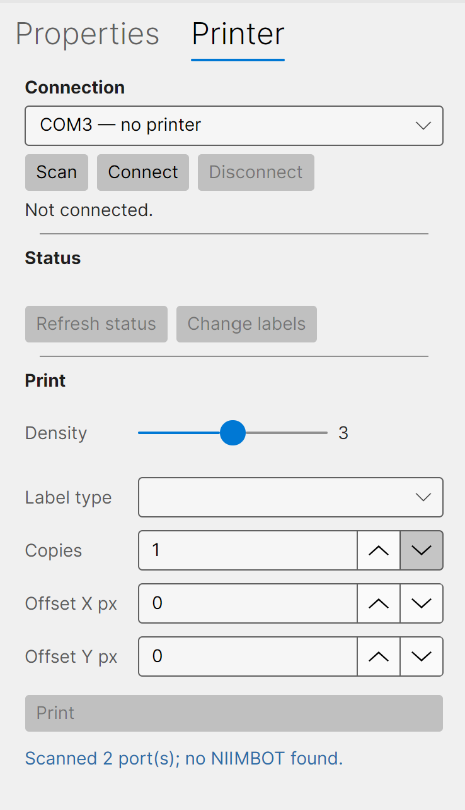
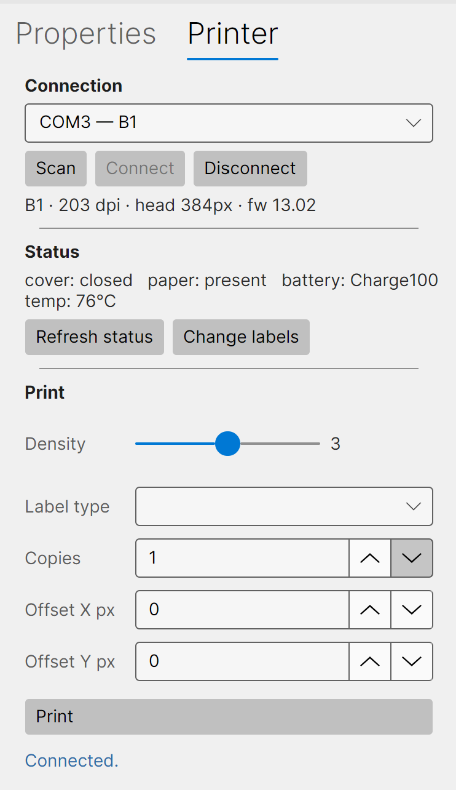

# Printing

Printing is handled from the **Printer** tab on the right. Connect your NIIMBOT printer over USB,
check its status, set the density, and print.

## Connecting a printer

Open the **Printer** tab. Before a printer is connected it shows no device and the controls are
greyed out.

1. Plug the printer in and turn it on.
2. Click **Scan** to list the available ports. Thermalith probes each one and labels it with the
   printer it finds (for example *COM3 — B1*).
3. Choose your printer from the **Connection** dropdown and click **Connect**.

Once connected, Thermalith shows the model, resolution, print-head width, and firmware version, and the
status line at the bottom reads *Connected*.

Click **Disconnect** when you're done, or to switch printers.

## Printer status

The **Status** section shows the live state of the printer — **cover** (open/closed), **paper**
(present/out), **battery**, and **temperature**. Click **Refresh status** to update it.

**Change labels** reads the roll currently loaded (on models with RFID-tagged rolls, such as the B1)
so the label setup can match the stock.

## Printing a label

In the **Print** section:

- **Density** — how dark the print is. Increase it for darker output, decrease it if fine detail is
  bleeding together. The right value depends on your label stock; a quick test print helps.
- **Label type** — the paper type, where applicable.
- **Copies** — how many labels to print.
- **Offset X px** / **Offset Y px** — nudge the printed image horizontally or vertically, in printer
  dots, to correct slight registration on your stock.

Click **Print** to send the label to the printer. (The **Print** button on the main toolbar does the
same thing.)

> **A note on alignment:** NIIMBOT printers feed the label through the head at a slight, consistent
> angle, so a printed label can show a small skew. This is a hardware characteristic — Thermalith sends
> a clean, straight image. Keep important content within the dashed printable-area guides so nothing is
> clipped, and use the **Offset** fields if the print sits slightly off-centre on your stock.

## Connection logging (troubleshooting)

If a printer isn't detected, or connects but won't respond, Thermalith can record the connection
conversation to a log file. The log is what makes a problem diagnosable without the developer owning your
exact model — it shows which serial ports were found, whether each opened, the bytes sent to the printer,
and whether anything came back. If you open an issue about a printer that won't connect, attaching this
log is the single most useful thing you can include.

**Turn it on:** open the **Help** menu and tick **Connection Logging**. A new log file starts
immediately; the status line at the bottom shows its full path.

**Reproduce the problem:** with logging on, do the thing that fails — usually **Scan** on the Printer
tab, then **Connect** to the printer. Everything the app tries is written to the log as it happens.

**Find the log:** choose **Help ▸ Open Log Folder…** to open the folder in your file manager. Each
session writes a timestamped file (`thermalith-YYYYMMDD-HHMMSS.log`); grab the most recent one. The
folder is:

- **Windows:** `%APPDATA%\Thermalith\logs`
- **macOS:** `~/Library/Application Support/Thermalith/logs`
- **Linux:** `~/.config/Thermalith/logs` (or `$XDG_CONFIG_HOME/Thermalith/logs`)

Turn **Connection Logging** back off when you're done — it isn't needed for normal use.

**Starting with logging already on.** If the app won't even open far enough to reach the menu, you can
arm logging before it starts: launch it with the `--debug` flag, or set the environment variable
`THERMALITH_DEBUG=1` before launching. Either records from the very first port scan. (On macOS/Linux run
the binary from a terminal to pass the flag; on Windows, `Thermalith.exe --debug`.)

The log contains only local device information — port names, printer model ids, and protocol bytes. It
holds nothing from your label designs.

<table width="100%"><tr>
<td width="50%" align="left" valign="bottom"></td>
<td width="50%" align="right" valign="bottom"></td>
</tr></table>
