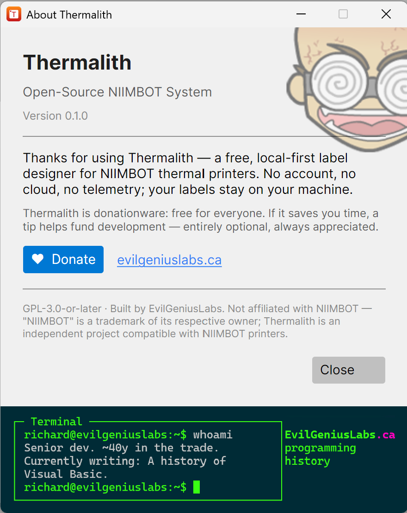

# About and keyboard shortcuts

## The About window

Open **Help → About** to see the version, licence, and donation information.

Thermalith is open source under the **GPL-3.0-or-later** licence and is free for everyone. If it's
useful to you, the **Donate** button (and the evilgeniuslabs.ca link) supports continued development —
entirely optional.

Thermalith is an independent project and is not affiliated with NIIMBOT; "NIIMBOT" is a trademark of
its respective owner.

## Keyboard shortcuts

Thermalith uses the standard shortcuts for your platform — **Ctrl** on Windows and Linux, **⌘
(Command)** on macOS.

| Action | Windows / Linux | macOS |
|---|---|---|
| New | Ctrl+N | ⌘N |
| Open | Ctrl+O | ⌘O |
| Save | Ctrl+S | ⌘S |
| Save As | Ctrl+Shift+S | ⇧⌘S |
| Print | Ctrl+P | ⌘P |
| Undo | Ctrl+Z | ⌘Z |
| Redo | Ctrl+Y | ⇧⌘Z |
| Cut / Copy / Paste | Ctrl+X / C / V | ⌘X / C / V |
| Duplicate | Ctrl+D | ⌘D |
| Delete | Delete | ⌫ |
| Select All | Ctrl+A | ⌘A |
| Group / Ungroup | Ctrl+G / Ctrl+Shift+G | ⌘G / ⇧⌘G |
| Bring to Front / Send to Back | Ctrl+Shift+] / Ctrl+Shift+[ | ⇧⌘] / ⇧⌘[ |
| Zoom In / Out / Fit | Ctrl++ / Ctrl+− / Ctrl+0 | ⌘+ / ⌘− / ⌘0 |
| Preferences | Ctrl+, | ⌘, |
| Quit | Alt+F4 | ⌘Q |

> While you're editing a text field (such as an element's content or a number box), the editing
> shortcuts act on that field rather than on the label.
